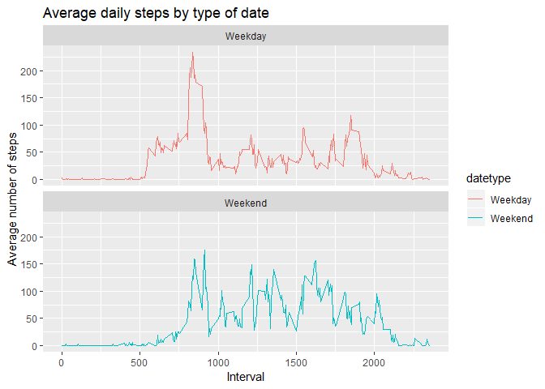

Project Requirement
-------------------

1.  Code for reading in the dataset and/or processing the data
2.  Histogram of the total number of steps taken each day
3.  Mean and median number of steps taken each day
4.  Time series plot of the average number of steps taken
5.  The 5-minute interval that, on average, contains the maximum number
    of steps
6.  Code to describe and show a strategy for imputing missing data
7.  Histogram of the total number of steps taken each day after missing
    values are imputed
8.  Panel plot comparing the average number of steps taken per 5-minute
    interval across weekdays and weekends
9.  All of the R code needed to reproduce the results (numbers, plots,
    etc.) in the report

Loading and Preprocessing the Data
----------------------------------

1.  Load the data

<!-- -->

    library(dplyr)
    library(ggplot2)
    activity <- read.csv("activity.csv")

What is mean total number of steps taken per day?
-------------------------------------------------

1.  Calculate the total number of steps taken per day

<!-- -->

    groupByData <- group_by(activity, date) %>% summarise(totalStepsPerDay = sum(steps, na.rm = T))
    names(groupByData) <- c("date", "steps")
    head(groupByData)

    ## # A tibble: 6 x 2
    ##   date       steps
    ##   <fct>      <int>
    ## 1 2012-10-01     0
    ## 2 2012-10-02   126
    ## 3 2012-10-03 11352
    ## 4 2012-10-04 12116
    ## 5 2012-10-05 13294
    ## 6 2012-10-06 15420

1.  If you do not understand the difference between a histogram and a
    barplot, research the difference between them. Make a histogram of
    the total number of steps taken each day

<!-- -->

    hist(groupByData$steps, main = "Total number of steps taken per day", xlab = "Total steps taken per day",
          ylim = c(0,20), breaks = seq(0,25000, by=2500))

1.  Calculate and report the mean and median of the total number of
    steps taken per day

<!-- -->

    mean(groupByData$steps)

    ## [1] 9354.23

    median(groupByData$steps)

    ## [1] 10395

What is the average daily activity pattern?
-------------------------------------------

1.  Make a time series plot (i.e. type="l") of the 5-minute interval
    (x-axis) and the average number of steps taken, averaged across all
    days (y-axis)

<!-- -->

    groupByDataMean <- group_by(activity, interval) %>% summarise(meanStepsPerDay = mean(steps, na.rm = T))
    names(groupByDataMean) <- c("interval", "mean")
    plot(groupByDataMean$interval, groupByDataMean$mean, type = "l",  xlab="Interval", ylab="Average number of steps", main="Average number of steps per intervals")

1.  Which 5-minute interval, on average across all the days in the
    dataset, contains the maximum number of steps?

<!-- -->

    groupByDataMean[which.max(groupByDataMean$mean), ]$interval

    ## [1] 835

Imputing missing values
-----------------------

1.  Calculate and report the total number of missing values in the
    dataset (i.e. the total number of rows with NAs)

<!-- -->

    sum(is.na(activity$steps))

    ## [1] 2304

1.  Devise a strategy for filling in all of the missing values in the
    dataset. The strategy does not need to be sophisticated. For
    example, you could use the mean/median for that day, or the mean for
    that 5-minute interval, etc.

<!-- -->

    imputed_steps <- groupByDataMean$mean[match(activity$interval, groupByDataMean$interval)]
    imputedActivity <- transform(activity, steps = ifelse(is.na(activity$steps), yes = imputed_steps, no = activity$steps))
    head(imputedActivity)

    ##       steps       date interval
    ## 1 1.7169811 2012-10-01        0
    ## 2 0.3396226 2012-10-01        5
    ## 3 0.1320755 2012-10-01       10
    ## 4 0.1509434 2012-10-01       15
    ## 5 0.0754717 2012-10-01       20
    ## 6 2.0943396 2012-10-01       25

1.  Create a new dataset that is equal to the original dataset but with
    the missing data filled in.

<!-- -->

    totalImputedSteps <- group_by(imputedActivity, date) %>% summarise(dailyTotalImputedSteps = sum(steps, na.rm = T))
    names(totalImputedSteps) <- c("date", "dailyTotalImputedSteps")
    head(totalImputedSteps)

    ## # A tibble: 6 x 2
    ##   date       dailyTotalImputedSteps
    ##   <fct>                       <dbl>
    ## 1 2012-10-01                 10766.
    ## 2 2012-10-02                   126 
    ## 3 2012-10-03                 11352 
    ## 4 2012-10-04                 12116 
    ## 5 2012-10-05                 13294 
    ## 6 2012-10-06                 15420

1.  Make a histogram of the total number of steps taken each day and
    Calculate and report the mean and median total number of steps taken
    per day. Do these values differ from the estimates from the first
    part of the assignment? What is the impact of imputing missing data
    on the estimates of the total daily number of steps?

<!-- -->

    hist(totalImputedSteps$dailyTotalImputedSteps, xlab = "Total steps per day", ylim = c(0,30), main = "Total number of steps taken each day", breaks = seq(0,25000,by=2500))

Are there differences in activity patterns between weekdays and weekends?
-------------------------------------------------------------------------

1.  Create a new factor variable in the dataset with two levels –
    “weekday” and “weekend” indicating whether a given date is a weekday
    or weekend day.

<!-- -->

    activity$date <- as.Date(strptime(activity$date, format="%Y-%m-%d"))
    activity$datetype <- sapply(activity$date, function(x) {
      ifelse(weekdays(x) == "Saturday" | weekdays(x) =="Sunday", "Weekend", "Weekday") 
    })
    head(select(activity, "date", "interval", "datetype"))

    ##         date interval datetype
    ## 1 2012-10-01        0  Weekday
    ## 2 2012-10-01        5  Weekday
    ## 3 2012-10-01       10  Weekday
    ## 4 2012-10-01       15  Weekday
    ## 5 2012-10-01       20  Weekday
    ## 6 2012-10-01       25  Weekday

1.  Make a panel plot containing a time series plot (i.e.type="l") of
    the 5-minute interval (x-axis) and the average number of steps
    taken, averaged across all weekday days or weekend days (y-axis).
    See the README file in the GitHub repository to see an example of
    what this plot should look like using simulated data.

<!-- -->

    byDateActivity <- group_by(activity, datetype, interval) %>% 
      summarise(averageSteps = mean(steps, na.rm = T)) %>%
      select("interval", "datetype", "averageSteps")
    plot<- ggplot(byDateActivity, aes(x = interval , y = averageSteps, color = datetype)) +
      geom_line() +
      labs(title = "Average daily steps by type of date", x = "Interval", y = "Average number of steps") +
      facet_wrap(~datetype, ncol = 1, nrow=2)
    print(plot)

